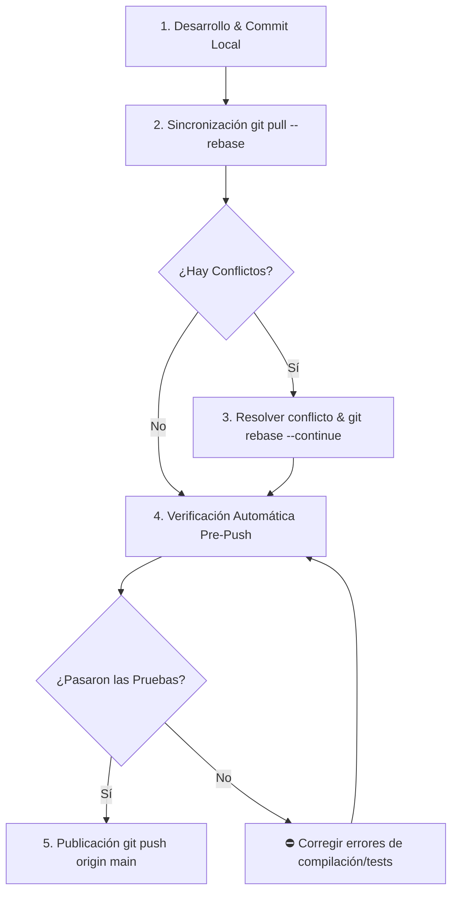

# 🚀 Skill: Direct-to-Trunk & Pair-Trunk Sync Protocol (`main`)

Este skill define el procedimiento de integración continua sobre la rama `main` para desarrollo ágil en paralelo entre dos colaboradores, asegurando historia lineal limpia, mensajes semánticos y cero regresiones.

---

## 📐 Principio Fundamental

> **"Nadie sube cambios al remoto sin haber rebasado explícitamente sus commits sobre la última versión de `main`."**

---

## ⚡ Flujo de Trabajo Integrado (Paso a Paso)

Cuando el usuario solicite **guardar**, **sincronizar**, **hacer commit** o **subir cambios (push)**:



---

## 🛠️ Detalle de Comandos

### Paso 1: Commit Local Semántico (Llamada Obligatoria a `git-conventional-commits`)
> ⚠️ **REGLA OBLIGATORIA DE SKILLS**:
> Al ejecutar este paso, el agente DEBE invocar y aplicar primero el skill **`git-conventional-commits`**.
> Queda estrictamente prohibido generar mensajes de una sola línea sin cuerpo explicativo ni pie de commit.

Formatear el mensaje según la estructura estricta de 3 partes del skill `git-conventional-commits`:
```bash
git add .
git commit -m "<emoji> <tipo>(<scope>): <resumen conciso en español>" \
           -m "<cuerpo explicativo detallado en español sobre el motivo y cambios de la implementación>" \
           -m "<pie de commit: Closes #issue, Co-authored-by o módulo afectado>"
```
*Scopes del Monorepo*: `api`, `mobile`, `database`, `docs`, `specs`, `config`.

### Paso 2: Sincronización Estricta vía Rebase
Traer y rebasar commits del remoto **sin modificar la configuración global**:
```bash
git pull --rebase origin main
```

### Paso 3: Manejo de Conflictos (si el proceso se detiene)
Si existen modificaciones concurrentes en las mismas líneas:
1. Inspeccionar y resolver las marcas `<<<<<<<`, `=======`, `>>>>>>>`.
2. Continuar el rebase:
```bash
git add .
git rebase --continue
```

### Paso 4: Quality Gate & Verificación Post-Rebase
Ejecutar la suite de pruebas del proyecto para asegurar que el rebase no rompió la compilación ni los tests:
```bash
# Backend (Laravel)
cd api && php artisan test

# Mobile (Flutter)
cd mobile && flutter analyze && flutter test
```

### Paso 5: Publicación a Remoto
Una vez validado el historial lineal:
```bash
git push origin main
```

---

## 🛡️ 3 Reglas de Oro Direct-to-Trunk

1. **Pull & Rebase Frecuente**: Sincronizar varias veces al día. Sincronizaciones pequeñas evitan conflictos complejos.
2. **Lock Verbal de Archivos Neurálgicos**: Comunicar cuando se modifiquen migraciones (`database/migrations`), rutas principales (`api/routes/api.php`) o bases de datos SQLite local (`app_database.dart`).
3. **Pruebas Verificadas Post-Rebase**: Nunca hacer `git push` si el entorno local no pasa la suite de pruebas tras el rebase.
