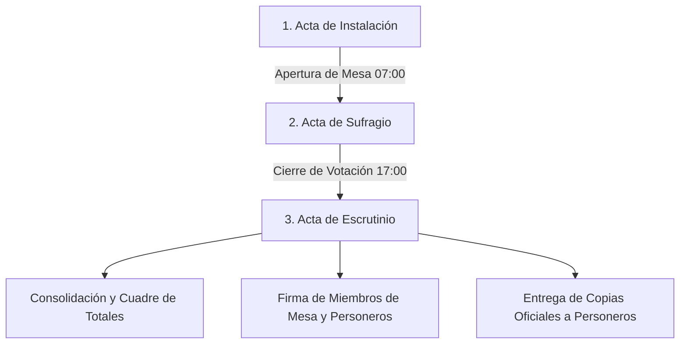

# 🗳️ Skill: Conteo, Registro de Actas y Escrutinio Electoral para Personeros (ONPE / JNE — ERM 2026)

Este skill provee las directrices oficiales, modelos de datos, reglas aritméticas de cuadre y procedimientos normativos que rigen el escrutinio de votos en el Perú, el llenado de las actas electorales por los miembros de mesa y el control, fiscalización y copia por parte de los personeros acreditados.

---

## 📜 1. Marco Normativo y Fundamentos del Acta Electoral

El **Acta Electoral** es el instrumento público fundamental e indivisible del sufragio en el Perú (Ley Orgánica de Elecciones N° 26859). En las Elecciones Regionales y Municipales (ERM), se compone de tres secciones cronológicas:



### 1.1. Las Tres Secciones del Acta Electoral
1. **Acta de Instalación:** Registra la hora de inicio, cantidad de cédulas recibidas, estado del material electoral y la presencia de miembros de mesa y personeros acreditados.
2. **Acta de Sufragio:** Registra la hora de término de la votación y el conteo de firmas y huellas digitales en el Padrón (Lista de Electores), determinando el dato oficial: **`Total de Ciudadanos que Votaron`**.
3. **Acta de Escrutinio:** Registra el conteo voto a voto extraído del ánfora (mediante la *Hoja Borrador de Escrutinio*), desglosado por cada Organización Política, votos en blanco, nulos, impugnados y el **`Total de Votos Emitidos`**.

---

## ⚖️ 2. Reglas Aritméticas de Cuadre y Validación Oficial (ONPE)

### 2.1. Igualdad Obligatoria en el Acta de Escrutinio
La regla de oro del escrutinio electoral establece que el número total de sufragantes debe coincidir exactamente con el total de votos contabilizados:

$$\mathbf{Total\ de\ Votos\ Emitidos} \equiv \mathbf{Total\ de\ Ciudadanos\ que\ Votaron}$$

Donde:
$$\mathbf{Total\ de\ Votos\ Emitidos} = \sum_{i=1}^{n} (\text{Votos Lista}_i) + \text{Votos en Blanco} + \text{Votos Nulos} + \text{Votos Impugnados}$$

### 2.2. Restricciones de Cota Máxima
$$\mathbf{Total\ de\ Ciudadanos\ que\ Votaron} \le \mathbf{Electores\ H\acute{a}biles\ (Padr\acute{o}n\ de\ Mesa)}$$
$$\mathbf{Total\ de\ Votos\ Emitidos} \le \mathbf{Electores\ H\acute{a}biles\ (Padr\acute{o}n\ de\ Mesa)}$$

---

## ⚠️ 3. Tipología de Actas Observadas (Tratamiento del JEE / JNE)

Cuando una mesa no cumple con el cuadre estricto, el acta pasa a condición de **Acta Observada** y es remitida al Jurado Electoral Especial (JEE) para su resolución mediante cotejo de ejemplares:

| Tipo de Observación | Condición Aritmética | Resolución Estándar JEE |
|---------------------|----------------------|--------------------------|
| **Error Material (Tipo A)** | $\text{Suma de Votos} \ne \text{Total Votos Emitidos}$ | Se coteja con el acta del JEE/JNE y se recalcula la suma real de las filas. |
| **Inconsistencia de Asistencia (Tipo B)** | $\text{Votos Emitidos} > \text{Ciudadanos que Votaron}$ | Se valida si el total excede los electores hábiles; de no exceder, se ajusta según el acta de sufragio cotejada. |
| **Votos Impugnados** | $\text{Votos Impugnados} > 0$ | El pleno del JEE abre los sobres especiales de impugnación y califica cada cédula en audiencia pública. |
| **Ilegibilidad / Sin Datos** | Cifras ilegibles o borrones en casillas | Se utiliza el ejemplar idéntico entregado al JEE o al JNE para recuperar el valor fidedigno. |

---

## 🪪 4. Casilla y Derechos del Personero de Mesa

En la parte inferior de las tres secciones del acta electoral (Instalación, Sufragio y Escrutinio), existe una **sección exclusiva para Personeros Acreditados**:

### 4.1. Estructura de la Casilla de Personeros en el Acta
Cada casilla contiene:
1. **Organización Política:** Nombre abreviado o símbolo del partido / movimiento regional.
2. **Nombres y Apellidos:** Identificación completa del personero de mesa acreditado.
3. **Número de DNI:** Documento de identidad verificado por el presidente de mesa.
4. **Firma:** Rúbrica voluntaria del personero certificando el resultado.

```
┌─────────────────────────────────────────────────────────────────────────────────────────────┐
│ 🔏 RELACIÓN Y FIRMAS DE PERSONEROS PRESENTES EN EL ESCRUTINIO                               │
├──────────────────────────────┬─────────────────────────┬──────────────┬─────────────────────┤
│ ORGANIZACIÓN POLÍTICA        │ NOMBRES Y APELLIDOS     │ N° DNI       │ FIRMA               │
├──────────────────────────────┼─────────────────────────┼──────────────┼─────────────────────┤
│ PARTIDO DEMOCRÁTICO SOMOS PERÚ│ Juan Carlos Pérez Rojas │ 45892134     │ [  Firma Aquí  ]    │
├──────────────────────────────┼─────────────────────────┼──────────────┼─────────────────────┤
│ ACCIÓN POPULAR               │ María Elena Quispe Flores│ 70124589     │ [  Firma Aquí  ]    │
└──────────────────────────────┴─────────────────────────┴──────────────┴─────────────────────┘
```

### 4.2. Derechos y Facultades del Personero
- **Vigilancia Visual:** Presenciar el conteo y la apertura de cada cédula sin manipular el material electoral.
- **Impugnación de Cédulas:** Impugnar votos cuando el trazo o marca no cumpla con las normas de intención de voto establecidas por la ONPE/JNE.
- **Formulación de Observaciones:** Exigir que conste en el campo de "Observaciones" cualquier discrepancia o incidente ocurrido en la mesa.
- **Copia del Acta (Constancia de Resultados):** Derecho irrenunciable a recibir una copia física auténtica del Acta de Escrutinio firmada por los miembros de mesa.
- **Digitalización Inmediata:** Capturar y registrar digitalmente el acta mediante sistemas de control paralelo y rápido recuento como **ConteoYA**.

---

## 📱 5. Reglas de Implementación en ConteoYA (App Móvil y Backend)

1. **Autosuma Dinámica:** Al ingresar votos en organizaciones políticas, votos en blanco, nulos o impugnados:
   - El campo `Total de Votos Emitidos` se recalcula automáticamente.
   - El campo `Ciudadanos que Votaron` se sincroniza automáticamente con el total calculado.
2. **Edición Permitida (Human-in-the-Loop):** Ambos campos deben permanecer siempre editables. Si el personero detecta que el acta física de los miembros de mesa consigna un error aritmético, debe poder ingresar exactamente lo que dice el documento físico.
3. **No Bloqueo por Advertencias:** Las discrepancias se alertan como avisos de consistencia (Warnings), pero nunca impiden la confirmación o guardado del acta.
4. **Trazabilidad Fotográfica:** Cada acta confirmada debe asociar la evidencia fotográfica con su respectivo hash SHA-256 inmutable.
