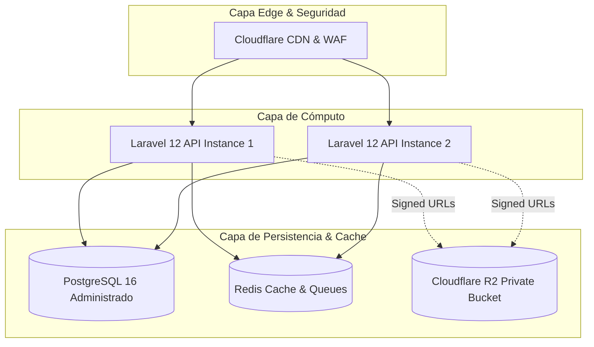

# 00 — Despliegue e Infraestructura Cloud (arc42 §7)

> **Documento:** Topología Cloud y Despliegue  
> **Proyecto:** ConteoYA — ERM 2026

---

## 1. Topología de Infraestructura

---

## 2. Componentes de Infraestructura

### 2.1 Backend API (Laravel 12)
- **Runtime:** PHP 8.2+ FPM / Nginx o Laravel Octane.
- **Seguridad:** Rate limiting por IP y por endpoint, CORS restrictivo y autenticación Sanctum.

### 2.2 Base de Datos (PostgreSQL 16+)
- **Pool de Conexiones:** PgBouncer para manejo eficiente de conexiones concurrentes en jornada electoral.
- **Esquema:** Integridad referencial estricta, índices `BTREE` en claves foráneas y columnas de filtro frecuente, vistas SQL y funciones `PL/pgSQL`.

### 2.3 Almacenamiento de Evidencias (Cloudflare R2)
- **Bucket Privado:** Cero acceso público directo.
- **Operación de Subida:** Upload binario directo desde el dispositivo cliente mediante URLs presignadas (evita saturar el ancho de banda del backend API).

### 2.4 Memoria y Colas (Redis 7.x)
- **Caché:** TTL configurado por tipo de catálogo (24h ubigeos, 12h organizaciones políticas).
- **Colas:** Procesamiento asíncrono de lotes de sincronización (`ProcessSyncOperationJob`).
