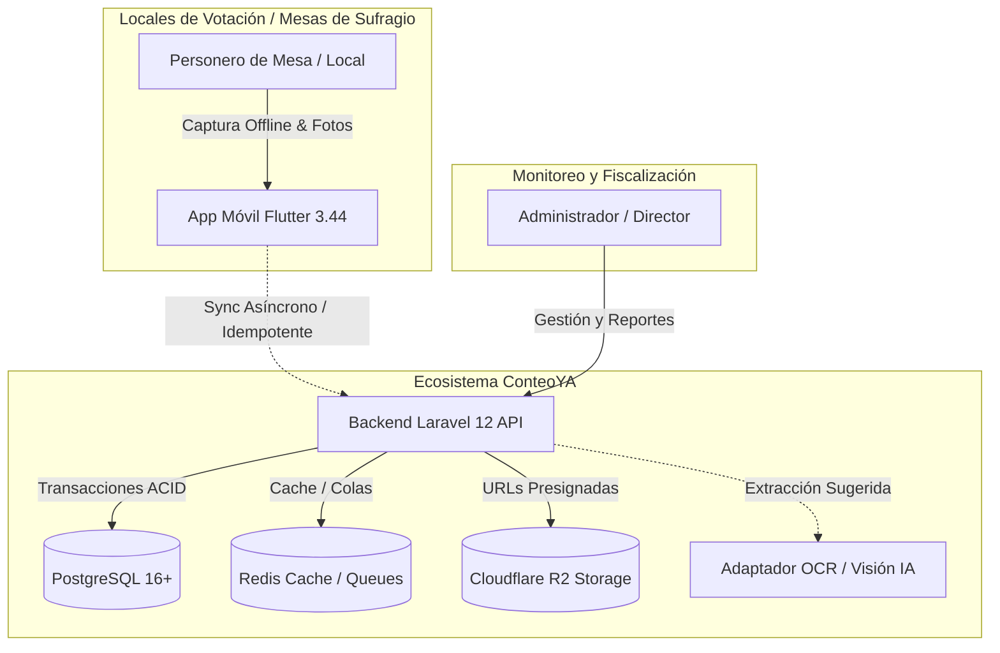

# 00 — Visión General de la Arquitectura (arc42 §1, §2, §3, §4)

> **Documento:** Visión General y Contexto Arquitectural  
> **Proyecto:** ConteoYA — Elecciones Regionales y Municipales 2026 (ERM 2026)

---

## 1. Introducción y Metas del Sistema

**ConteoYA** es una plataforma tecnológica de misión crítica para la captura, validación, fiscalización y consolidación de actas electorales para las Elecciones Regionales y Municipales 2026 (ERM 2026) en Perú.

### 1.1 Metas de Calidad Primarias
1. **Resiliencia Offline Total:** Capacidad de operar y registrar votos en zonas sin cobertura celular mediante almacenamiento local seguro (Drift SQLite).
2. **Idempotencia Absoluta:** Garantía de que ninguna fluctuación de red o reintento masivo duplique actas o votos (`client_operation_id` + `IdempotencyMiddleware`).
3. **Inalterabilidad de Evidencias:** Cada fotografía capturada se firma localmente con SHA-256 antes de guardarse o transmitirse al bucket privado Cloudflare R2.
4. **Human-in-the-Loop:** La inteligencia artificial/OCR solo asiste y propone datos con métricas de confianza; el personero humano siempre valida y confirma el acta.

---

## 2. Restricciones Inviolables de Arquitectura

1. **La IA nunca confirma un acta:** Es un principio de negocio estricto. El estado de las actas procesadas por IA inicia en `DRAFT` hasta confirmación humana explícita.
2. **Bucket Cloudflare R2 estrictamente privado:** El acceso a los objetos se realiza única y exclusivamente mediante URLs presignadas de corta duración generadas por el backend (15 min para subida, 60 min para descarga).
3. **Control de Propiedad de Mesa:** Un personero solo puede crear o editar actas de las mesas que tiene asignadas formalmente en el sistema.

---

## 3. Diagrama de Contexto del Sistema (C4 Nivel 1)

---

## 4. Estrategia de Solución

- **Ecosistema Multi-Aplicación Desacoplado:** Un backend API unificado en Laravel 12 con PostgreSQL 16 y una app móvil en Flutter 3.44 con base de datos reactiva Drift.
- **Resolución Inteligente de Cédulas:** Desacoplamiento de centros de votación (`electoral_locations`) mediante vistas SQL (`v_polling_stations_ubigeo`, `v_electoral_ballot_lists`) y función almacenada `fn_get_polling_station_ballot`.
- **Validaciones No Bloqueantes:** Si la suma de votos difiere del total de votantes, el sistema registra el acta pero adjunta advertencias (`warnings`) para auditoría posterior sin perder los datos de campo.
