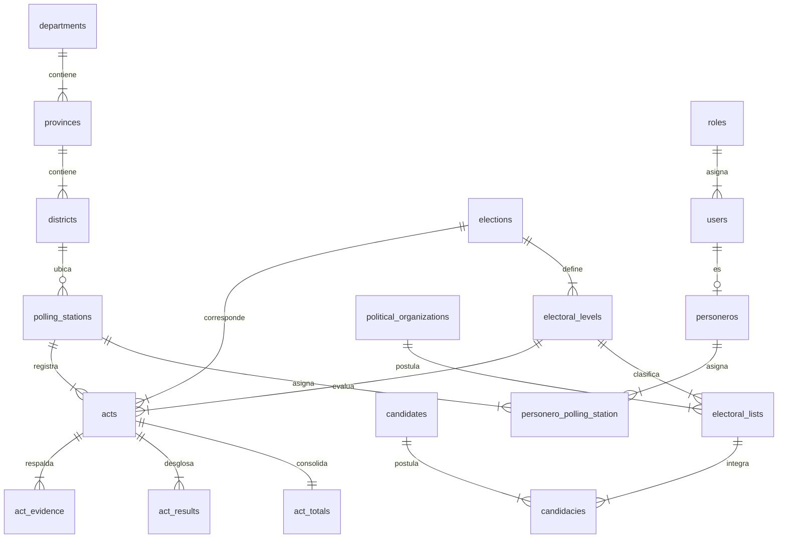

# 01 — Módulo: Modelado de Base de Datos (PostgreSQL 16)

> **Módulo:** Base de Datos Relacional  
> **Motor:** PostgreSQL 16+ · Esquema 3FN · Vistas y Funciones Almacenadas

---

## 1. Principios de Diseño del Esquema

1. **Separación Catálogo / Transacción:** Desacoplamiento entre datos maestros electorales (Ubigeo, Partidos, Listas, Candidatos) y la dinámica transaccional (Actas, Totales, Resultados, Evidencias, Auditoría).
2. **Niveles Electorales Polimórficos (`electoral_levels`):** Permite procesar de manera uniforme elecciones a Gobernador, Consejero Regional, Alcalde Provincial y Alcalde Distrital.
3. **Idempotencia Estricta:** Restricciones de unicidad compuesta `UNIQUE (polling_station_id, election_id, electoral_level_id)` en `acts` y `UNIQUE (client_operation_id)` en `sync_operations`.

---

## 2. Diagrama Entidad-Relación (Mermaid)

---

## 3. Vistas SQL y Funciones Almacenadas

### `v_polling_stations_ubigeo`
Resuelve la ubicación geográfica completa de cada mesa sin depender de la existencia previa de un local en `electoral_locations`.

### `v_electoral_ballot_lists`
Mapea cada mesa con las organizaciones políticas, listas y candidatos habilitados para competir según el nivel electoral correspondiente.

### `fn_get_polling_station_ballot(p_station_code, p_level_id)`
Función `PL/pgSQL` (`STABLE`) que computa y retorna en formato `JSONB` de alto rendimiento la cédula completa de votación lista para ingesta de actas.
