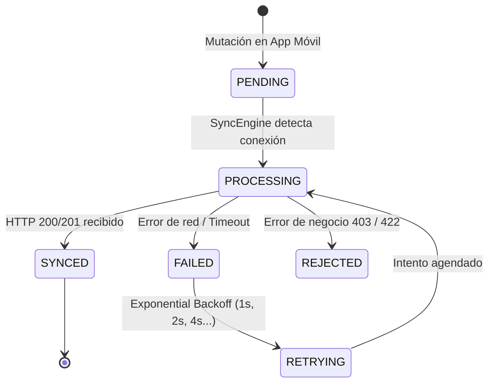
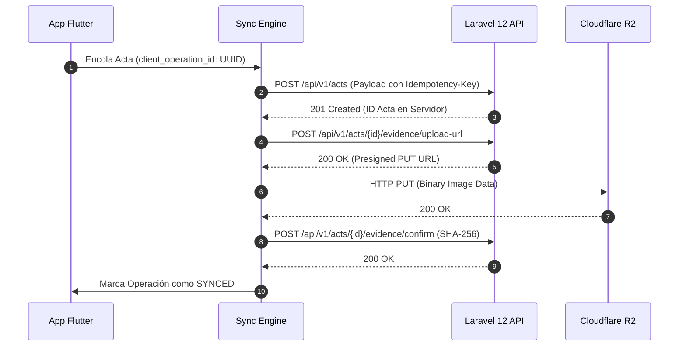

# 01 — Módulo: Motor de Sincronización Offline-First (Sync Engine)

> **Módulo:** Sincronización Bidireccional  
> **Patrón:** Asynchronous Sync Engine · Exponential Backoff · Idempotencia

---

## 1. Ciclo de Vida de una Operación de Sincronización

Cada acción generada en la aplicación móvil crea un registro inmutable en `local_sync_operations_table` con un UUID generado en el cliente (`client_operation_id`).

---

## 2. Flujo de Sincronización de Actas y Evidencias

