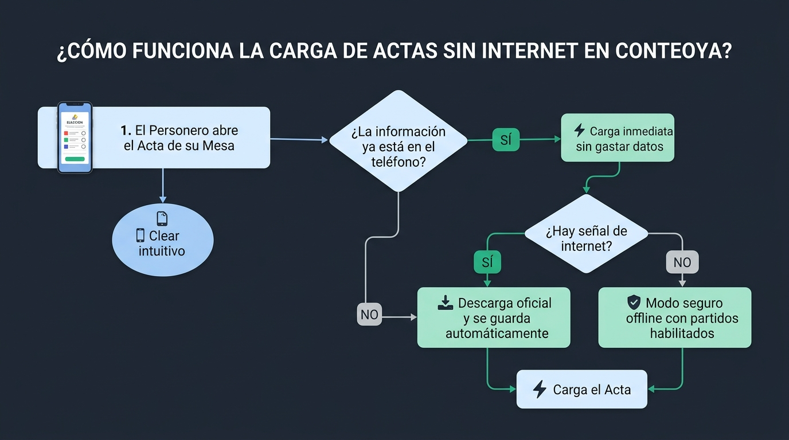
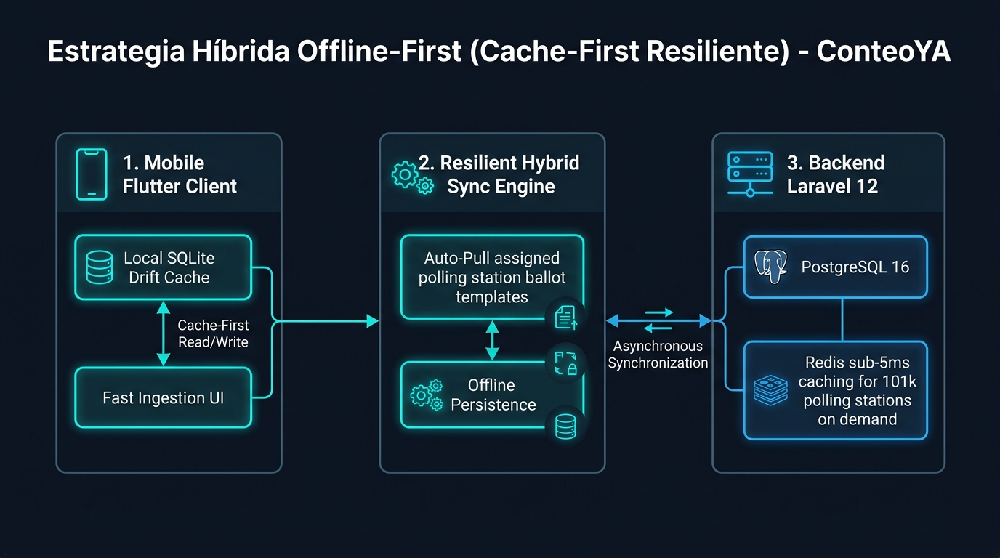
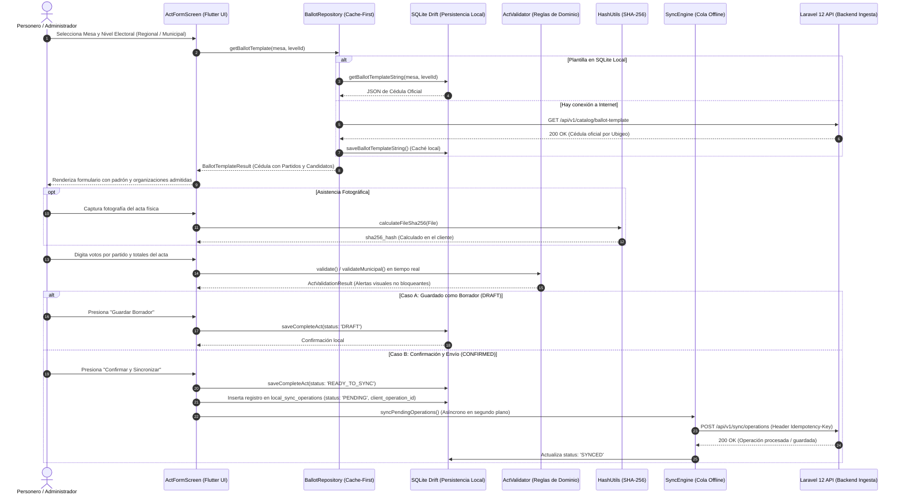

# 03 — Guía: Ingesta de Actas Electorales y Pruebas

> **Guía:** How-To Operativo & Referencia Técnica  
> **Tema:** Ingesta de Actas, Validación Aritmética, Idempotencia y Pruebas

---

## 1. Visión General del Proceso de Ingesta

El proceso de registro e ingesta de actas electorales en **ConteoYA** sigue una arquitectura **Offline-First** y respeta estrictamente el principio **Human-in-the-Loop**:
1. El personero u operador captura la fotografía del acta física en su dispositivo móvil.
2. Se calcula la huella criptográfica **SHA-256** del archivo localmente antes de cualquier persistencia o transmisión.
3. Se digitan los votos por organización política y los totales del acta.
4. El motor de validación [`ActValidator`](file:///home/fredy/Documents/Proyectos/conteoya-project/mobile/lib/features/acts/domain/act_validator.dart) ejecuta comprobaciones de consistencia numérica en tiempo real emitiendo **Soft Warnings** si existen descuadres.
5. El personero confirma los datos y la app guarda localmente en Drift SQLite y encola una operación de sincronización idempotente hacia el backend Laravel.

---

## 2. Estrategia de Solución Híbrida Offline-First (Cache-First Resiliente)

Para atender a más de **101,000 mesas de votación** a nivel nacional sin saturar el almacenamiento de los dispositivos móviles ni depender de una conexión continua a internet, ConteoYA implementa una arquitectura híbrida con doble nivel de visualización:

### 2.1. Flujo Operativo para Personeros y Usuarios (No Técnico)
Permite a los personeros y miembros de mesa comprender cómo la aplicación garantiza la captura ininterrumpida de sus actas con o sin cobertura celular:



1. **Apertura del Acta:** El personero selecciona su mesa asignada en la app móvil.
2. **Carga Inmediata (Cache Local):** Si la información ya fue descargada previamente, la cédula y listas de candidatos cargan en **0 segundos sin gastar datos móviles**.
3. **Descarga Automática con Señal:** Si es la primera vez que abre la mesa y tiene señal, la app consulta el backend oficial y guarda la plantilla localmente.
4. **Modo Seguro Offline:** Si se encuentra en una zona remota sin señal de internet, el sistema activa el catálogo maestro local para permitir el registro y fotografía sin bloqueos.

### 2.2. Arquitectura Técnica de Ingesta (Para Desarrolladores)
Detalla la interacción entre el cliente Flutter (SQLite Drift), el motor de sincronización (`SyncEngine`) y el backend Laravel 12 con PostgreSQL 16 y Redis:





---

## 2. Reglas de Validación Numérica (`ActValidator`)

Las actas electorales físicas pueden contener inconsistencias aritméticas cometidas por los miembros de mesa. ConteoYA aplica el principio de **inconsistencias no bloqueantes**:

1. **Suma de Votos:**
   $$\sum \text{Votos de Organizaciones} + \text{Blancos} + \text{Nulos} + \text{Impugnados} = \text{Total Votos Emitidos}$$
   *Si no coincide, se emite la advertencia `TOTAL_MISMATCH` pero se permite el registro si el personero confirma que refleja el acta física.*
2. **Asistencia vs. Padrón:**
   $$\text{Ciudadanos que Votaron} \le \text{Electores Hábiles}$$
   *Si supera el padrón, se emite `VOTERS_EXCEED_REGISTERED`.*
3. **Total Emitido vs. Padrón:**
   $$\text{Total Votos Emitidos} \le \text{Electores Hábiles}$$
   *Si supera el padrón, se emite `VOTES_EXCEED_REGISTERED`.*
4. **Total Emitido vs. Asistencia:**
   $$\text{Total Votos Emitidos} \le \text{Ciudadanos que Votaron}$$
   *Si supera la asistencia, se emite `VOTES_EXCEED_ATTENDANCE`.*

---

## 3. Desacoplamiento Atómico en Elecciones Municipales

En las elecciones municipales peruanas se eligen simultáneamente dos cargos en una misma cédula:
- **Alcalde Provincial** (`electoral_level_id = 2`)
- **Alcalde Distrital** (`electoral_level_id = 3`)

### Comportamiento en la Aplicación Móvil:
1. El formulario muestra dos columnas independientes de entrada de votos: *Municipal Provincial* y *Municipal Distrital*.
2. Si una organización política solo postula a nivel provincial (o fue tachada a nivel distrital por el JEE), el campo distrital se bloquea mostrando el badge *"No postula"*.
3. Al confirmar, el sistema genera **dos actas completas independientes en SQLite**, cada una con su propio `client_act_uuid` y encola **dos `SyncOperation` atómicas** independientes.

---

## 4. Referencia de Endpoints API de Ingesta

### 4.1. Registro Directo o Sincronizado de Acta

#### Endpoint
`POST /api/v1/acts`

#### Headers
```http
Authorization: Bearer {token_sanctum}
Content-Type: application/json
Idempotency-Key: 550e8400-e29b-41d4-a716-446655440000
```

#### Request Body (JSON)
```json
{
  "client_operation_id": "550e8400-e29b-41d4-a716-446655440000",
  "polling_station_code": "030390",
  "election_id": 1,
  "electoral_level_id": 1,
  "status": "CONFIRMED",
  "totals": {
    "registered_voters": 300,
    "voters_who_voted": 280,
    "total_votes": 280,
    "blank_votes": 10,
    "null_votes": 5,
    "challenged_votes": 0
  },
  "results": [
    {
      "political_organization_id": 4,
      "political_organization_name": "ACCIÓN POPULAR",
      "votes": 150,
      "source": "MANUAL"
    },
    {
      "political_organization_id": 14,
      "political_organization_name": "PARTIDO DEMOCRÁTICO SOMOS PERÚ",
      "votes": 115,
      "source": "MANUAL"
    }
  ]
}
```

#### Response `201 Created`
```json
{
  "data": {
    "id": 1,
    "client_act_uuid": "550e8400-e29b-41d4-a716-446655440000",
    "status": "CONFIRMED",
    "is_valid": true,
    "warnings": []
  }
}
```

---

## 5. Matriz de Pruebas Automatizadas

La suite de pruebas en `api/` y `mobile/` cubre integralmente:

| Módulo de Prueba | Comprobación | Resultado |
| :--- | :--- | :--- |
| `ActIngestionTest` | Creación de acta con totales válidos | ✅ Pass |
| `ActIngestionTest` | Descuadre de totales genera soft warnings sin bloquear | ✅ Pass |
| `ActIngestionTest` | Idempotencia evita actas duplicadas y retorna respuesta cacheada | ✅ Pass |
| `ActOwnershipPolicyTest` | Personero no puede registrar actas de mesas no asignadas | ✅ Pass |
| `EvidenceUploadTest` | Solicitud de presigned URL y confirmación de hash SHA-256 | ✅ Pass |
| `SyncEngineApiTest` | Procesamiento por lotes idempotente en cola de sincronización | ✅ Pass |

