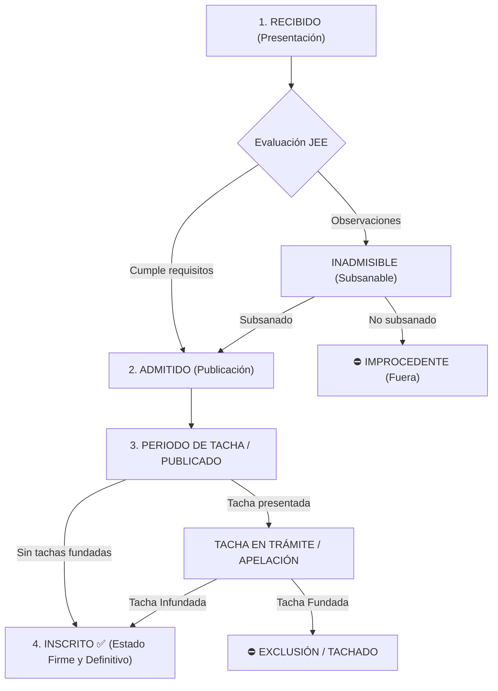

# 06 — Glosario: Términos Electorales ERM 2026

> **Glosario:** Terminología Electoral y Técnica (Perú)

---

| Término / Sigla | Definición |
|---|---|
| **ERM 2026** | Elecciones Regionales y Municipales 2026 en la República del Perú. |
| **JNE** | Jurado Nacional de Elecciones (Máxima autoridad electoral fiscalizadora). |
| **ONPE** | Oficina Nacional de Procesos Electorales (Organizador del acto electoral). |
| **JEE** | Jurado Electoral Especial (Órgano de justicia electoral de primera instancia). |
| **ODPE** | Oficina Descentralizada de Procesos Electorales. |
| **Mesa de Sufragio (`polling_station`)** | Unidad básica electoral identificada por un código único de 6 dígitos (ej. `030390`) compuesta habitualmente por un máximo de 300 electores. |
| **Local de Votación (`electoral_location`)** | Edificación física (colegio, instituto, recinto) que alberga una o más mesas de sufragio. |
| **Acta Electoral / Acta de Escrutinio** | Documento oficial físico donde los miembros de mesa registran el conteo final de votos de una mesa para un nivel electoral específico. |
| **Personero de Mesa** | Representante acreditado de una organización política encargado de vigilar y fiscalizar la votación y el escrutinio en una o más mesas de sufragio. |
| **Voto Preferencial** | Modalidad donde el ciudadano puede elegir a uno o dos candidatos específicos dentro de una lista de regidores o consejeros regionales. |
| **Electores Hábiles (`registered_voters`)** | Número total de ciudadanos habilitados para votar en una mesa específica según el padrón oficial. |
| **Ciudadanos que Votaron (`voters_who_voted`)** | Total de personas que acudieron efectivamente a sufragar en la mesa. |
| **Votos Válidos / Nulos / Blancos / Impugnados** | Desglose aritmético de los votos emitidos según su condición legal. |
| **SHA-256** | Algoritmo criptográfico de resumen utilizado para garantizar la inalterabilidad de la evidencia fotográfica del acta. |
| **Human-in-the-Loop** | Principio de diseño donde la automatización e IA nunca toman decisiones vinculantes sin la verificación y confirmación activa de una persona. |
| **`id_hoja_vida`** | Identificador único asignado por el JNE (Voto Informado) a la declaración jurada de vida de cada candidato. Utilizado para la sincronización de datos biográficos y antecedentes. |

---

## 📋 Ciclo de Vida y Estados de Listas Electorales y Candidaturas (JNE / JEE)

Durante el proceso electoral (ERM 2026), las listas y candidaturas atraviesan distintas fases normativas antes de quedar firmes en la cédula oficial de votación:

### 🗳️ Criterio de Inclusión en Cédulas y Actas de ConteoYA

| Estado | ¿Aparece en Cédula / Acta? | Consideración Técnica y Electoral |
|---|:---:|---|
| **`INSCRITO`** | ✅ **SÍ (Definitivo)** | Lista con inscripción firme y consentida por resolución del JEE. |
| **`ADMITIDO`** / **`PERIODO DE TACHA`** / **`TACHA EN TRAMITE`** / **`PUBLICADO`** | 🟡 **SÍ (En Carrera)** | Listas en competencia formal mientras concluye el calendario electoral de tachas/apelaciones. |
| **`IMPROCEDENTE`** / **`INADMISIBLE`** / **`EXCLUSION`** / **`RETIRO`** / **`RENUNCIA`** | ❌ **NO (Excluido)** | Listas o candidaturas que no participan en el escrutinio de la mesa. |

