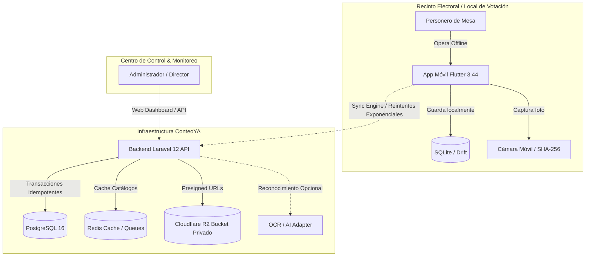
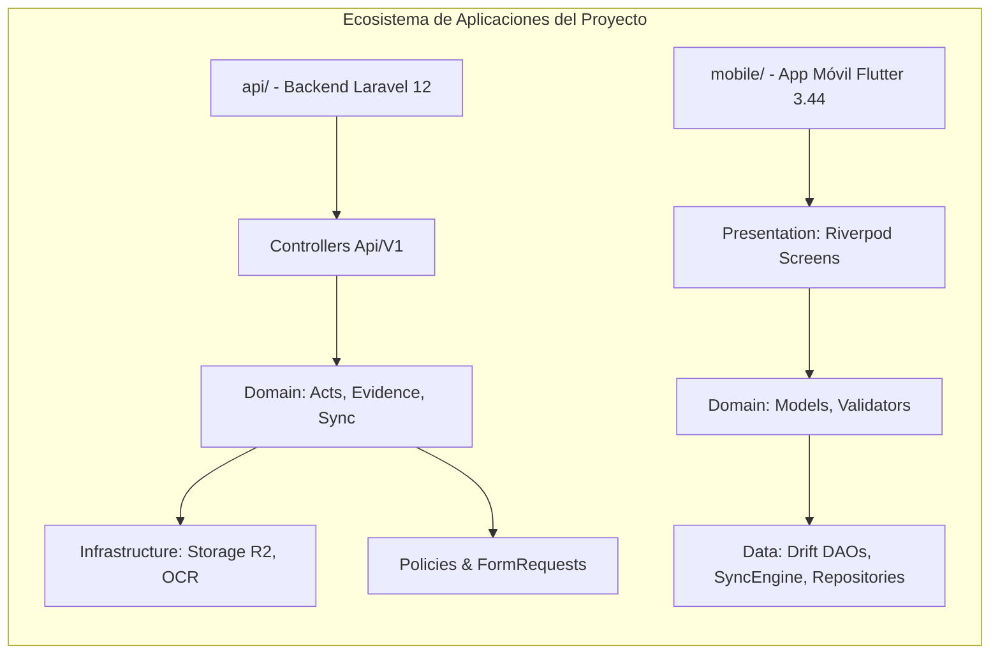

# ConteoYA — Documentación de Arquitectura de Software (arc42)

> **Estándar:** arc42 Architecture Template (v8.2)  
> **Estructura de Contenido:** Inspirado en el marco Diátaxis (Explicación y Referencia)  
> **Proyecto:** ConteoYA  
> **Dominio:** Elecciones Regionales y Municipales 2026 (ERM 2026) — Perú  
> **Versión:** 1.0.0 (Fase 0: Foundation & Fase 1: Ingesta Offline-First)

---

## 1. Introducción y Metas

### 1.1 Resumen del Sistema
**ConteoYA** es una plataforma tecnológica de misión crítica diseñada para la captura, verificación, consolidación y fiscalización en tiempo real de actas electorales para las Elecciones Regionales y Municipales 2026 (ERM 2026) en el Perú. Permite a personeros de mesa capturar los resultados de votación y fotografías de actas en condiciones de conectividad nula o intermitente (**Offline-First**), asistidos opcionalmente por inteligencia artificial/OCR con intervención humana obligatoria (**Human-in-the-Loop**), garantizando trazabilidad e idempotencia en la ingesta masiva de datos.

### 1.2 Objetivos de Calidad
1. **Disponibilidad y Resiliencia Offline:** La aplicación móvil debe permitir el 100% de los flujos de captura, validación aritmética local y almacenamiento seguro sin conexión a internet.
2. **Idempotencia Estricta:** Ninguna operación de red duplicada o reintento de sincronización debe alterar o duplicar registros electorales.
3. **Auditabilidad e Integridad:** Cada acta registrada cuenta con hash SHA-256 de su evidencia fotográfica original, firma temporal, dispositivo emisor y bitácora inmutable en base de datos.
4. **Seguridad y Confidencialidad:** Acceso granular por roles (`ADMIN`, `DIRECTOR`, `PERSONERO`), ownership de mesa estricto y almacenamiento privado en Cloudflare R2 mediante presigned URLs efímeras.

### 1.3 Partes Interesadas (Stakeholders)
- **Personeros de Mesa / Local:** Usuarios de campo que capturan datos y fotos en locales de votación.
- **Directores / Coordinadores Electorales:** Supervisores que monitorean el avance de captura por circunscripción.
- **Administradores del Sistema:** Gestores de usuarios, mesas de sufragio y catálogos electorales.

---

## 2. Restricciones de la Arquitectura

### 2.1 Restricciones Técnicas
- **Backend:** Laravel 12 (PHP 8.2+), Laravel Sanctum, Dedoc Scramble (OpenAPI 3.1).
- **Base de Datos Principal:** PostgreSQL 16+ con soporte JSONB, vistas optimizadas y funciones almacenadas PL/pgSQL.
- **Cache & Colas:** Redis para aceleración de catálogos y colas de sincronización.
- **Almacenamiento de Evidencias:** Cloudflare R2 (S3-compatible, bucket 100% privado con presigned URLs).
- **App Móvil:** Flutter 3.44+ (Dart) con Clean Architecture, Riverpod y base de datos local SQLite con Drift v5.

### 2.2 Restricciones de Negocio / Inviolables
1. **La IA nunca confirma un acta:** Los servicios OCR/IA únicamente sugieren valores y niveles de confianza (`confidence`). El personero humano siempre confirma.
2. **Bucket R2 nunca es público:** El acceso de subida (15 min) y descarga (60 min) es estrictamente presignado por la API.
3. **Restricción de Circunscripción:** Un personero solo puede crear o editar actas de las mesas que tiene explícitamente asignadas.

---

## 3. Contexto y Alcance



---

## 4. Estrategia de la Solución

1. **Patrón Offline-First + Sync Engine Asíncrono:**
   - La base de datos local SQLite (Drift) almacena las operaciones con UUID de cliente (`client_operation_id`).
   - El `SyncEngine` en Flutter gestiona una máquina de estados con cálculo de backoff exponencial y detección de conectividad.
2. **Idempotencia en Dos Niveles:**
   - En el cliente mediante `client_operation_id` único por mutación.
   - En la API mediante el `IdempotencyMiddleware` y el constraint único `UNIQUE (client_operation_id)` en `sync_operations`.
3. **Resolución Jerárquica de Cédula Electoral:**
   - Desacoplamiento de centros de votación (`electoral_locations`) mediante vistas SQL (`v_polling_stations_ubigeo`, `v_electoral_ballot_lists`) y la función almacenada `fn_get_polling_station_ballot` en PostgreSQL 16.
4. **Validaciones No Bloqueantes:**
   - Si la suma de votos difiere del total emitido, la ingesta no falla con error `422`; se registra el acta y se devuelven `warnings` auditables.

---

## 5. Vista de Bloques de Construcción (Building Block View)



### Componentes Clave:
- **`ActController` / `ActService`:** Orquestador de la transacción atómica de actas, totales y resultados.
- **`CatalogController`:** Entrega ubigeos y la plantilla de la cédula mediante `fn_get_polling_station_ballot`.
- **`EvidenceController` & `CloudflareR2StorageProvider`:** Generación y validación de presigned URLs y verificación de integridad SHA-256.
- **`SyncEngine` & `SyncController`:** Procesamiento por lotes y sincronización bidireccional idempotente.

---

## 6. Vista de Ejecución (Runtime View)

### Flujo de Registro y Sincronización de Acta Electoral

```mermaid
sequenceDiagram
    autonumber
    actor Personero
    participant Mobile as Flutter (Drift DB)
    participant Sync as Sync Engine
    participant API as Laravel 12 API
    participant PG as PostgreSQL 16
    participant R2 as Cloudflare R2

    Personero->>Mobile: Ingresa votos y captura foto del acta
    Mobile->>Mobile: Calcula SHA-256 local y guarda en Drift (LocalAct, LocalActEvidence)
    Mobile->>Sync: Encola SyncOperation (UUID)
    
    rect rgb(240, 248, 255)
        Note over Mobile,API: Sincronización cuando hay red
        Sync->>API: POST /api/v1/acts (con Idempotency-Key)
        API->>PG: BEGIN TRANSACTION; Act::updateOrCreate + Totals + Results; COMMIT;
        API-->>Sync: 201 Created (Act Data + Warnings)
        
        Sync->>API: POST /api/v1/acts/{id}/evidence/upload-url
        API-->>Sync: 200 OK (Presigned PUT URL, TTL 15 min)
        Sync->>R2: HTTP PUT (Binary Image Payload)
        R2-->>Sync: 200 OK
        Sync->>API: POST /api/v1/acts/{id}/evidence/confirm (SHA-256)
        API->>PG: ActEvidence::create()
        API-->>Sync: 200 OK
    end
    Sync->>Mobile: Actualiza estado local a SYNCED
```

---

## 7. Vista de Despliegue (Deployment View)

- **Servidor de Aplicación:** PHP 8.2+ FPM / Nginx o Laravel Octane detrás de Cloudflare CDN.
- **Base de Datos:** PostgreSQL 16 Administrado con réplica de lectura opcional y extensiones UUID/pgcrypto.
- **Cache / Memoria:** Redis 7.x para caché de catálogo y colas de sincronización.
- **Storage:** Cloudflare R2 Object Storage con cifrado en reposo.

---

## 8. Conceptos Transversales (Cross-Cutting Concepts)

1. **Seguridad y Autorización:** Implementación mediante Laravel Policies (`ActPolicy`, `EvidencePolicy`) que garantizan que los personeros solo operen sus mesas asignadas.
2. **Manejo de Errores e Idempotencia:** `IdempotencyMiddleware` intercepta peticiones repetidas y devuelve la respuesta cacheada sin re-ejecutar lógica de negocio.
3. **Observabilidad:** Bitácora inmutable en la tabla `audit_logs` con `user_id`, acción, entidad afectada, IP y user-agent.

---

## 9. Decisiones de Arquitectura (ADR Summary)

| ID | Decisión | Estado | Consecuencia / Razón |
|---|---|---|---|
| **ADR-001** | Uso de PostgreSQL 16 con JSONB | Aceptado | Permite manejar esquemas de resultados semiestructurados y alto rendimiento en consultas de agregación. |
| **ADR-002** | Vistas y Funciones Almacenadas para Cédula | Aceptado | Desacopla la falta de `electoral_locations` y reduce la latencia de armado del formulario a un solo round-trip SQL. |
| **ADR-003** | Cloudflare R2 con Presigned URLs | Aceptado | Cero costo de egress, máxima seguridad al mantener el bucket privado y sin credenciales en la app cliente. |
| **ADR-004** | Drift SQLite v5 para App Móvil | Aceptado | Consultas reactivas, soporte de transacciones ACID locales y migraciones seguras. |
