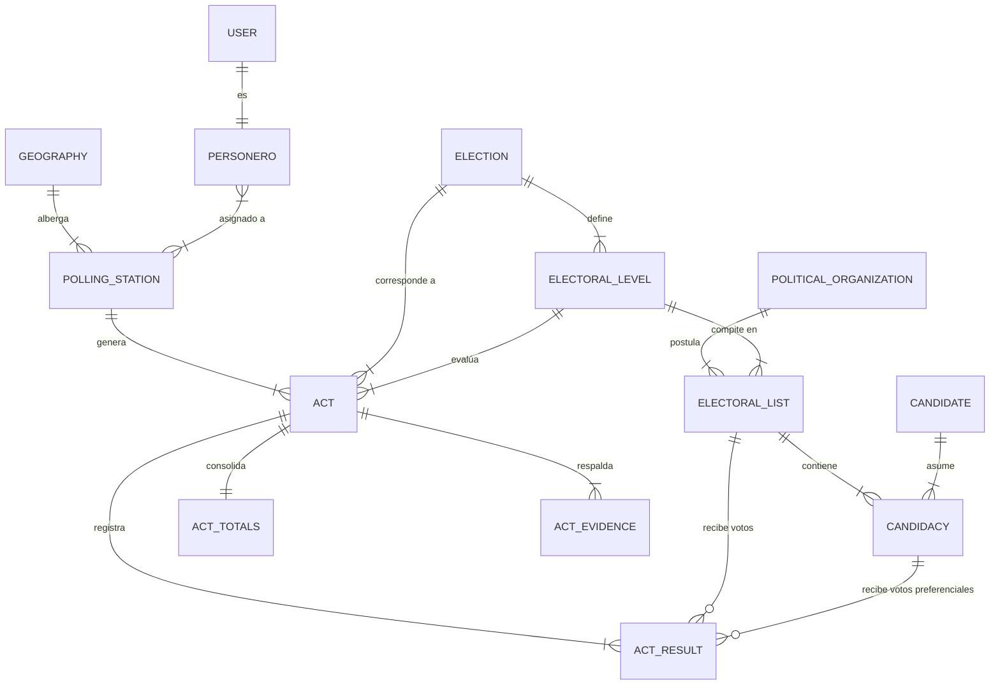

# ConteoYA — Documentación del Modelado de Base de Datos (Fases 0 y 1)

**Proyecto:** ConteoYA  
**Dominio:** Elecciones Regionales y Municipales 2026 (ERM 2026) — Perú  
**Motor Target:** PostgreSQL 16+  
**API Backend:** Laravel 12 + Sanctum + Dedoc Scramble  
**Última actualización:** Fase 0 — v0.1.0  

---

## 1. Introducción y Alcance

El presente documento establece el diseño y modelado integral de la base de datos relacional para la plataforma **ConteoYA**, cubriendo los requerimientos especificados para la **Fase 0 (Foundation / Datos Maestros)** y la **Fase 1 (Ingesta de Actas, Offline-First, Evidencia e Idempotencia)**.

### Principios Arquitecturales del Diseño:
1. **Desacoplamiento Catálogo / Transacción:** Separación estricta entre los datos maestros electorales (Ubigeo, Organizaciones, Candidaturas, Mesas) y la dinámica transaccional (Actas, Votos, Evidencias, Auditoría, Sincronización).
2. **Soporte Polimórfico de Niveles Electorales (Nivel Electoral Dinámico):** El modelo no utiliza columnas estáticas rígidas (como `votos_gobernador`, `votos_alcalde`). En su lugar, soporta de forma genérica niveles electorales (*REGIONAL_GOBERNADOR*, *REGIONAL_CONSEJERO*, *PROVINCIAL_ALCALDE*, *PROVINCIAL_REGIDOR*, *DISTRITAL_ALCALDE*, *DISTRITAL_REGIDOR*).
3. **Resiliencia Offline e Idempotencia:** Integración de claves de idempotencia (`client_operation_id`) y trazabilidad de sincronización desde clientes móviles (SQLite/Drift).
4. **Human-In-The-Loop & Auditability:** Distinción clara de la fuente de captura (`MANUAL`, `OCR`, `AI`, `IMPORTED`), almacenamiento de evidencia fotográfica inalterable con hashes SHA-256 y registro histórico completo de auditoría.

---

## 2. Fase de Análisis: Modelo Conceptual

En la fase de análisis conceptual se identifican las entidades clave agrupadas por dominios funcionales y sus interrelaciones de alto nivel.

### Entidades Identificadas por Dominio:

1. **Dominio Geográfico (Ubigeo Electoral):**
   - `departments`: Departamentos / Regiones del Perú.
   - `provinces`: Provincias.
   - `districts`: Distritos.
   - `electoral_locations`: Locales de votación (colegios, escuelas, recintos).
   - `polling_stations`: Mesas de sufragio (código de 6 dígitos ej: `030390`).

2. **Dominio Catálogo Electoral & Candidaturas:**
   - `elections`: Procesos electorales (ej. ERM 2026).
   - `electoral_levels`: Niveles de elección (Gobernador, Consejero, Alcalde Provincial, Regidor Provincial, Alcalde Distrital, Regidor Distrital).
   - `political_organizations`: Organizaciones políticas (partidos, movimientos regionales).
   - `candidates`: Personas naturales candidatas.
   - `electoral_lists`: Listas de candidatos presentadas ante el JEE.
   - `candidacies`: Relación asociativa candidato-lista-cargo-posición (voto preferencial/regiduria).

3. **Dominio Ingesta, Actas y Evidencia (Fase 1):**
   - `acts`: Encabezado de acta por mesa, elección y nivel electoral.
   - `act_results`: Desglose de votos por lista electoral / candidato / votos nulos / blancos / impugnados.
   - `act_totals`: Totales de control del acta (electores hábiles, ciudadanos que votaron, total votos emitidos).
   - `act_evidence`: Fotografía del acta y metadatos de almacenamiento (Cloudflare R2 / S3, SHA-256).
   - `ocr_ai_extractions`: Registro de propuestas extraídas por OCR/IA con nivel de confianza.

4. **Dominio Usuarios, Roles, Personeros, Dispositivos e Idempotencia:**
   - `roles`: Roles del sistema (`ADMIN`, `DIRECTOR`, `PERSONERO`) con integridad referencial.
   - `users`: Usuarios del sistema con FK `role_id` hacia `roles` y columna `role` para acceso rápido.
   - `personeros`: Perfil de personero de mesa/centro de votación (solo usuarios con rol `PERSONERO`).
   - `devices`: Dispositivos móviles registrados (asociados a un personero).
   - `personero_polling_station`: Asignación de personeros a mesas.
   - `sync_operations`: Log de sincronización idempotente offline-to-online.
   - `audit_logs`: Trazabilidad de auditoría de todas las acciones.

---

## 3. Fase de Diseño: Modelo Lógico (3FN)

El modelo lógico normaliza las entidades a Tercera Forma Normal (3FN), asegurando integridad referencial con claves primarias y foráneas bien definidas.

### Resumen del Esquema de Tablas:

| Tabla | Descripción | PK / Clave Primaria | Claves Foráneas (FK) |
|---|---|---|---|
| `departments` | Departamentos | `code` (VARCHAR 5) | — |
| `provinces` | Provincias | `code` (VARCHAR 5) | `department_code` |
| `districts` | Distritos | `code` (VARCHAR 6) | `department_code`, `province_code` |
| `electoral_locations` | Locales de votación | `id` (BIGINT) | `district_code` |
| `polling_stations` | Mesas de votación | `id` (BIGINT) / `code` (VARCHAR 10) | `electoral_location_id` |
| `elections` | Procesos Electorales | `id` (BIGINT) | — |
| `electoral_levels` | Niveles Electorales | `id` (BIGINT) | `election_id` |
| `political_organizations` | Partidos / Movimientos | `id` (BIGINT) | — |
| `electoral_lists` | Listas Electorales | `id` (BIGINT) | `political_organization_id`, `electoral_level_id`, Ubigeo FKs |
| `candidates` | Candidatos (Personas) | `id` (BIGINT) | — |
| `candidacies` | Postulación Candidato | `id` (BIGINT) | `electoral_list_id`, `candidate_id` |
| **`roles`** | **Roles del sistema** | `id` (BIGINT) | — |
| `users` | Usuarios API | `id` (BIGINT) | **`role_id` → `roles`** |
| `personeros` | Personeros de Mesa | `id` (BIGINT) | `user_id` |
| `devices` | Dispositivos Móviles | `id` (BIGINT) | `personero_id` |
| `personero_polling_station` | Asignación Mesa-Personero | `id` (BIGINT) | `personero_id`, `polling_station_id` |
| `acts` | Actas Electorales | `id` (BIGINT) | `election_id`, `electoral_level_id`, `polling_station_id`, `captured_by_personero_id` |
| `act_totals` | Totales del Acta | `id` (BIGINT) | `act_id` |
| `act_results` | Resultados de Votos | `id` (BIGINT) | `act_id`, `political_organization_id`, `electoral_list_id`, `candidate_id` |
| `act_evidence` | Evidencia Fotográfica | `id` (BIGINT) | `act_id`, `device_id` |
| `sync_operations` | Operaciones Offline | `id` (BIGINT) | `device_id`, `personero_id` |
| `audit_logs` | Auditoría de Cambios | `id` (BIGINT) | `user_id` |

---

## 4. Fase de Diseño Físico (PostgreSQL 16+)

En el diseño físico se especifican los tipos de datos nativos de PostgreSQL 16+, restricciones `CHECK`, índices `BTREE`/`GIN`, campos `TIMESTAMPTZ` y funciones/triggers de actualización de `updated_at`.

### Reglas de Negocio Físicas Implementadas:
- `CHECK (voters_who_voted <= registered_voters)` en `act_totals`.
- `CHECK (total_votes >= 0, blank_votes >= 0, null_votes >= 0, challenged_votes >= 0)` en `act_totals`.
- Restricción de unicidad `UNIQUE (polling_station_id, election_id, electoral_level_id)` en `acts` para evitar doble registro de acta.
- Restricción `UNIQUE (client_operation_id)` en `sync_operations` para garantizar la idempotencia de reintentos de red.
- Índices `BTREE` en claves foráneas para búsquedas de alta performance en consolidación.

---

## 5. Mapeo desde SQLite (erm2026.db) / JEE JSON

La base de datos original `database/erm2026.db` (proveniente del JEE) se mapea hacia la arquitectura limpia PostgreSQL de la siguiente manera:

- `departments` (SQLite: `code`, `name`) ➔ `departments` (PG)
- `provinces` (SQLite: `code`, `name`, `department_code`) ➔ `provinces` (PG)
- `districts` (SQLite: `code`, `name`, `department_code`, `province_code`) ➔ `districts` (PG)
- `political_organizations` (SQLite: `id`, `name`, `short_name`, `logo_url`) ➔ `political_organizations` (PG)
- `electoral_lists` (SQLite: `id_solicitud_lista`, `organization_id`, `election_type`, ubigeos) ➔ `electoral_lists` (PG)
- `candidates` (SQLite: `id`, `id_solicitud_lista`, `id_hoja_vida`, `full_name`, `position`) ➔ `candidates` + `candidacies` (PG)

---

## 6. Archivo SQL DDL

El script SQL completo para la creación de tablas, índices, constraints y triggers se encuentra disponible en:
[database/schema_v1_postgres.sql](file:///home/fredy/Documents/Proyectos/conteoya-project/database/schema_v1_postgres.sql)
